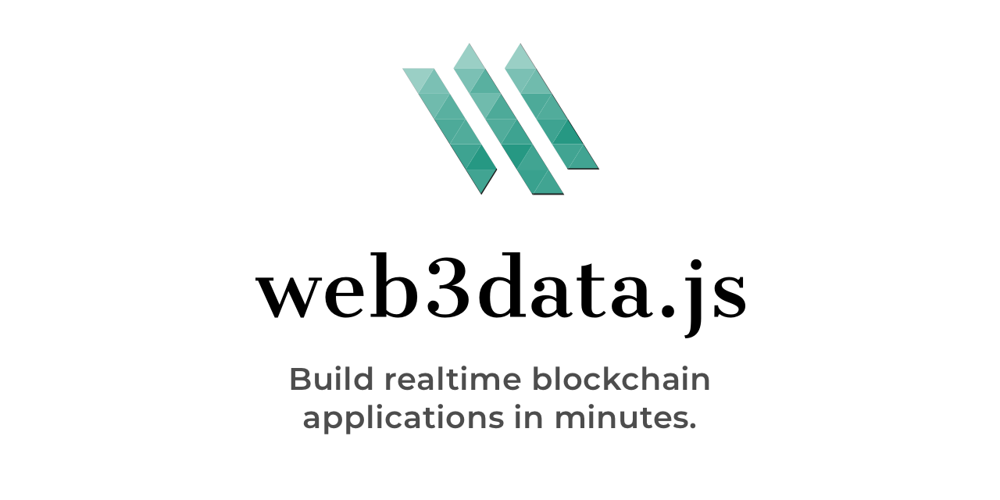

[](https://travis-ci.com/web3data/web3data-js)
[](https://github.com/xojs/xo)
[](https://npm.runkit.com/web3data-js)

# Web3data.js Javascript API
Wrapper for [Amberdata.io](http://amberdata.io)'s [REST API](http://docs.amberdata.io/reference)

## Installation
<i>Note that you must have node (and npm) installed.</i>

Using npm:
```bash
npm install web3data-js
```

Using CDN:
```html
<script src="https://unpkg.com/web3data-js/dist/web3data.min.js"></script>
```

## The API Key
Visit [Amberdata.io](https://amberdata.io/pricing) and select the developer plan to get started!

Once you've got your key, place it in a file named `.env` &mdash; see [env.example](./env.example) for reference.

Then in you code you can use it like so:

```javascript
const web3Data = new Web3Data(process.env.API_KEY)
```

## Configuration
Web3data configuration is simple and only requires an API Key upon instantiation.
```javascript
const web3data = new Web3Data('API_KEY')
```

Additionally, you can pass in a config object containing a blockchainId:
```javascript
const web3data = new Web3Data('API_KEY', {
  blockchainId: '1c9c969065fcd1cf' // Ethereum Mainnet
})
```
This will allow you to switch between different blockchain / networks when making
requests via web3data.js.

You can find the full [list of blockchain IDs](https://docs.amberdata.io/reference#blockchain-ids) in our docs.


## Simple Usage Example

For more examples, [click here to head over to view more quick examples](/examples). For a full spectrum of guides, tutorials & sample code, go to [our Amberdata Documentation](https://amberdata.io/docs). For filters & optional parameters, please [refer to the API documentation](https://docs.amberdata.io).

#### Within Node
```js
import Web3Data from 'web3data-js'

const w3d = new Web3Data('<api-key>')

;( async () => {
     const contract = await w3d.contract.getDetails("0x06012c8cf97bead5deae237070f9587f8e7a266d")
     console.log(contract) // { ... }
})()
```

#### Websockets Events
```js
import Web3Data from 'web3data-js'

const w3d = new Web3Data('<api-key>')

w3d.connect(status => {
  console.log('status ->', status.type)
})
w3d.on({eventName: 'block'}, data => {
  console.log(data)
})
```

## Blockchains/Networks
It's possible to the namespace convention to specify which blockchain to use when making requests.
This makes it easier to switch between blockchains as Web3data will automatically set the correct headers under
the hood.

### Supported Blockchain Namespaces

<table style="width:100%">
  <tr>
    <th>Name</th>
    <th>Namespace</th>
  </tr>
  <tr>
    <td>default</td>
    <td>web3data.* (Ethereum)</td>
  </tr>
  <tr>
    <td>Bitcoin</td>
    <td>web3data.btc</td>
  </tr>
  <tr>
    <td>Ethereum</td>
    <td>web3data.eth</td>
  </tr>
  <tr>
    <td>Litecoin</td>
    <td>web3data.ltc</td>
  </tr>
  <tr>
    <td>Bitcoin Cash</td>
    <td>web3data.bch</td>
  </tr>
  <tr>
    <td>Bitcoin SV</td>
    <td>web3data.bsv</td>
  </tr>
  <tr>
    <td>Stellar</td>
    <td>web3data.xlm</td>
  </tr>
  <tr>
    <td>Zcash</td>
    <td>web3data.zec</td>
  </tr>
</table>

### Ethereum

**Namespace**: `.eth`

<details><summary><b>Supported Methods </b></summary>

<table style="width:100%">
  <tr>
    <th>address</th>
    <th>block</th>
    <th>contract</th>
    <th>market</th>
    <th>transaction</th>
  </tr>
  <tr>
    <td>getBalance</td>
    <td>getBlockNumber</td>
    <td>getCode</td>
    <td>getEtherPrice</td>
    <td>getTransaction</td>
  </tr>
  <tr>
    <td></td>
    <td>getBlock</td>
    <td></td>
    <td></td>
    <td>getPendingTransactions</td>
  </tr>
  <tr>
    <td></td>
    <td>getBlockTransactionCount</td>
    <td></td>
    <td></td>
    <td>getGasPrice</td>
  </tr>
  <tr>
    <td></td>
    <td>getTransactionFromBlock</td>
    <td></td>
    <td></td>
    <td></td>
  </tr>
  <tr>
    <td></td>
    <td>getTransactions</td>
    <td></td>
    <td></td>
    <td></td>
  </tr>
  <tr>
    <td></td>
    <td>getMetrics</td>
    <td></td>
    <td></td>
    <td></td>
  </tr>
</table>
</details>

##### Example:
```javascript
web3data.eth.address.getBalance('0x734Ac651Dd95a339c633cdEd410228515F97fAfF')
```

### Bitcoin

**Namespace**: `.btc`

<details><summary><b>Supported Methods </b></summary>

<table style="width:100%">
  <tr>
    <th>address</th>
    <th>block</th>
    <th>transaction</th>
  </tr>
  <tr>
    <td>getAllAddresses</td>
    <td>getBlocks</td>
    <td>getTransactions</td>
  </tr>
  <tr>
    <td>getInformation</td>
    <td>getBlock</td>
    <td>getTransaction</td>
  </tr>
  <tr>
    <td>getMetadata</td>
    <td>getBlockNumber</td>
    <td>getPendingTransactions</td>
  </tr>
  <tr>
    <td>getTransactions</td>
    <td>getTransactions</td>
    <td>getMetrics</td>
  </tr>
  <tr>
    <td>getPendingTransactions</td>
    <td>getTransactionFromBlock</td>
    <td></td>
  </tr>
  <tr>
    <td>getBalance</td>
    <td>getMetrics</td>
    <td></td>
  </tr>
  <tr>
    <td>getLatestBalance</td>
    <td></td>
    <td></td>
  </tr>
  <tr>
    <td>getHistoricalBalance</td>
    <td></td>
    <td></td>
  </tr>
  <tr>
    <td>getMultipleBalances</td>
    <td></td>
    <td></td>
  </tr>
  <tr>
    <td>getBalancesBatch</td>
    <td></td>
    <td></td>
  </tr>
  <tr>
    <td>getMetrics</td>
    <td></td>
    <td></td>
  </tr>
</table>
</details>

##### Example:
```javascript
web3data.btc.address.getBalance('1MUz4VMYui5qY1mxUiG8BQ1Luv6tqkvaiL')
```

### Litecoin

**Namespace**: `.ltc`

<details><summary><b>Supported Methods </b></summary>

<table style="width:100%">
  <tr>
    <th>address</th>
    <th>block</th>
    <th>transaction</th>
  </tr>
  <tr>
    <td>getAllAddresses</td>
    <td>getBlocks</td>
    <td>getTransactions</td>
  </tr>
  <tr>
    <td>getInformation</td>
    <td>getBlock</td>
    <td>getTransaction</td>
  </tr>
  <tr>
    <td>getMetadata</td>
    <td>getBlockNumber</td>
    <td>getPendingTransactions</td>
  </tr>
  <tr>
    <td>getTransactions</td>
    <td>getTransactions</td>
    <td>getMetrics</td>
  </tr>
  <tr>
    <td>getBalance</td>
    <td>getTransactionFromBlock</td>
    <td></td>
  </tr>
  <tr>
    <td>getLatestBalance</td>
    <td>getMetrics</td>
    <td></td>
  </tr>
  <tr>
    <td>getHistoricalBalance</td>
    <td></td>
    <td></td>
  </tr>
  <tr>
    <td>getMultipleBalances</td>
    <td></td>
    <td></td>
  </tr>
  <tr>
    <td>getBalancesBatch</td>
    <td></td>
    <td></td>
  </tr>
  <tr>
    <td>getMetrics</td>
    <td></td>
    <td></td>
  </tr>
</table>
</details>

##### Example:
```javascript
web3data.ltc.address.getBalance('LZo1qx6S5JEVh43KahTFBdvnkVFeQCz9Ze')
```


### Bitcoin Cash

**Namespace**: `.bch`

<details><summary><b>Supported Methods </b></summary>

<table style="width:100%">
  <tr>
    <th>address</th>
    <th>block</th>
    <th>transaction</th>
  </tr>
  <tr>
    <td>getAllAddresses</td>
    <td>getBlocks</td>
    <td>getTransactions</td>
  </tr>
  <tr>
    <td>getInformation</td>
    <td>getBlock</td>
    <td>getTransaction</td>
  </tr>
  <tr>
    <td>getMetadata</td>
    <td>getBlockNumber</td>
    <td>getPendingTransactions</td>
  </tr>
  <tr>
    <td>getTransactions</td>
    <td>getTransactions</td>
    <td>getMetrics</td>
  </tr>
  <tr>
    <td>getBalance</td>
    <td>getTransactionFromBlock</td>
    <td></td>
  </tr>
  <tr>
    <td>getLatestBalance</td>
    <td>getMetrics</td>
    <td></td>
  </tr>
  <tr>
    <td>getHistoricalBalance</td>
    <td></td>
    <td></td>
  </tr>
  <tr>
    <td>getMultipleBalances</td>
    <td></td>
    <td></td>
  </tr>
  <tr>
    <td>getBalancesBatch</td>
    <td></td>
    <td></td>
  </tr>
  <tr>
    <td>getMetrics</td>
    <td></td>
    <td></td>
  </tr>
</table>
</details>

##### Example:
```javascript
web3data.bch.address.getBalance('1MUz4VMYui5qY1mxUiG8BQ1Luv6tqkvaiL')
```

### Bitcoin SV

**Namespace**: `.bsv`

<details><summary><b>Supported Methods </b></summary>

<table style="width:100%">
  <tr>
    <th>address</th>
    <th>block</th>
    <th>transaction</th>
  </tr>
  <tr>
    <td>getAllAddresses</td>
    <td>getBlocks</td>
    <td>getTransactions</td>
  </tr>
  <tr>
    <td>getInformation</td>
    <td>getBlock</td>
    <td>getTransaction</td>
  </tr>
  <tr>
    <td>getMetadata</td>
    <td>getBlockNumber</td>
    <td>getPendingTransactions</td>
  </tr>
  <tr>
    <td>getTransactions</td>
    <td>getTransactions</td>
    <td>getMetrics</td>
  </tr>
  <tr>
    <td>getBalance</td>
    <td>getTransactionFromBlock</td>
    <td></td>
  </tr>
  <tr>
    <td>getLatestBalance</td>
    <td>getMetrics</td>
    <td></td>
  </tr>
  <tr>
    <td>getHistoricalBalance</td>
    <td></td>
    <td></td>
  </tr>
  <tr>
    <td>getMultipleBalances</td>
    <td></td>
    <td></td>
  </tr>
  <tr>
    <td>getBalancesBatch</td>
    <td></td>
    <td></td>
  </tr>
  <tr>
    <td>getMetrics</td>
    <td></td>
    <td></td>
  </tr>
</table>
</details>

##### Example:
```javascript
web3data.bsv.address.getBalance('1MUz4VMYui5qY1mxUiG8BQ1Luv6tqkvaiL')
```


### Stellar

**Namespace**: `.xlm`

<details><summary><b>Supported Methods </b></summary>

<table style="width:100%">
  <tr>
    <th>address</th>
    <th>block</th>
    <th>transaction</th>
  </tr>
  <tr>
    <td>getAllAddresses</td>
    <td>getBlocks</td>
    <td>getTransactions</td>
  </tr>
  <tr>
    <td>getInformation</td>
    <td>getBlock</td>
    <td>getTransaction</td>
  </tr>
  <tr>
    <td>getMetadata</td>
    <td>getBlockNumber</td>
    <td>getPendingTransactions</td>
  </tr>
  <tr>
    <td>getTransactions</td>
    <td>getTransactions</td>
    <td>getMetrics</td>
  </tr>
  <tr>
    <td>getBalance</td>
    <td>getTransactionFromBlock</td>
    <td></td>
  </tr>
  <tr>
    <td>getLatestBalance</td>
    <td>getMetrics</td>
    <td></td>
  </tr>
  <tr>
    <td>getHistoricalBalance</td>
    <td></td>
    <td></td>
  </tr>
  <tr>
    <td>getMultipleBalances</td>
    <td></td>
    <td></td>
  </tr>
  <tr>
    <td>getBalancesBatch</td>
    <td></td>
    <td></td>
  </tr>
  <tr>
    <td>getMetrics</td>
    <td></td>
    <td></td>
  </tr>
</table>
</details>

##### Example:
```javascript
web3data.xlm.address.getBalance('GB42PDYTMHVL7FG2KQ6DGCJSEOF6RXWX7BYJ7UISU5GCRRA5DPCY2X7R')
```

### Zcash

**Namespace**: `.zec`

<details><summary><b>Supported Methods </b></summary>

<table style="width:100%">
  <tr>
    <th>address</th>
    <th>block</th>
    <th>transaction</th>
  </tr>
  <tr>
    <td>getAllAddresses</td>
    <td>getBlocks</td>
    <td>getTransactions</td>
  </tr>
  <tr>
    <td>getInformation</td>
    <td>getBlock</td>
    <td>getTransaction</td>
  </tr>
  <tr>
    <td>getMetadata</td>
    <td>getBlockNumber</td>
    <td>getPendingTransactions</td>
  </tr>
  <tr>
    <td>getTransactions</td>
    <td>getTransactions</td>
    <td>getMetrics</td>
  </tr>
  <tr>
    <td>getBalance</td>
    <td>getTransactionFromBlock</td>
    <td></td>
  </tr>
  <tr>
    <td>getLatestBalance</td>
    <td>getMetrics</td>
    <td></td>
  </tr>
  <tr>
    <td>getHistoricalBalance</td>
    <td></td>
    <td></td>
  </tr>
  <tr>
    <td>getMultipleBalances</td>
    <td></td>
    <td></td>
  </tr>
  <tr>
    <td>getBalancesBatch</td>
    <td></td>
    <td></td>
  </tr>
  <tr>
    <td>getMetrics</td>
    <td></td>
    <td></td>
  </tr>
</table>
</details>

##### Example:
```javascript
web3data.zec.address.getBalance('t1M5GSbdVpPA1XFkuzi12sJyqGkrEEfGwLJ')
```

Note: When using the namespaced methods the blockchain Id set during instantiation will be ignored.
